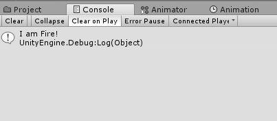

# EditorButton
Add Button from method to Inspector Unity3D

[](https://discord.gg/UWkHKB)




## Installation
Download the UnityPackage from the [latest releases](https://github.com/Kilosoft/EditorButton/releases) and import it into Unity. The directory can be moved after being imported.

## Usage
Add
```C#
using Kilosoft.tools
```
Mark any public method(void) with the attribute [EditorButton(name = "")]

```C#
using UnityEngine;
using Kilosoft.Tools;

/// <summary>
/// Test script
/// </summary>
public class TestScriptButton : MonoBehaviour
{
    [EditorButton("Test Button [Press me]")]
    public void TestMethod()
    {
        Debug.Log("I am Fire!");
    }
}
```
`Thank you! Good luck!
Kilosoft`
