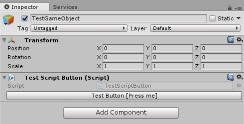
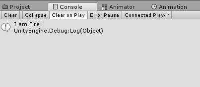

# EditorButton
Добавляет кнопку в любой MonoBehaviour для любых публичных методов void без параметров





## Установка
Скачайте UnityPackage тут [latest releases](https://github.com/Kilosoft/EditorButton/releases) и импортируйте в Unity. Папку можете перенести в любое место.

## Использование
Добавьте
```C#
using Kilosoft.tools
```
Отметьте любой публичный метод void без параметров атрибутом [EditorButton(name = "")]
```C#
using UnityEngine;
using Kilosoft.Tools;

/// <summary>
/// Тестовый скрипт
/// </summary>
public class TestScriptButton : MonoBehaviour
{
    [EditorButton("Тестовая кнопка [Нажми меня]")]
    public void TestMethod()
    {
        Debug.Log("Я ОГОНь!");
    }
}
```
`Спасибо! Удачи!
Kilosoft`
